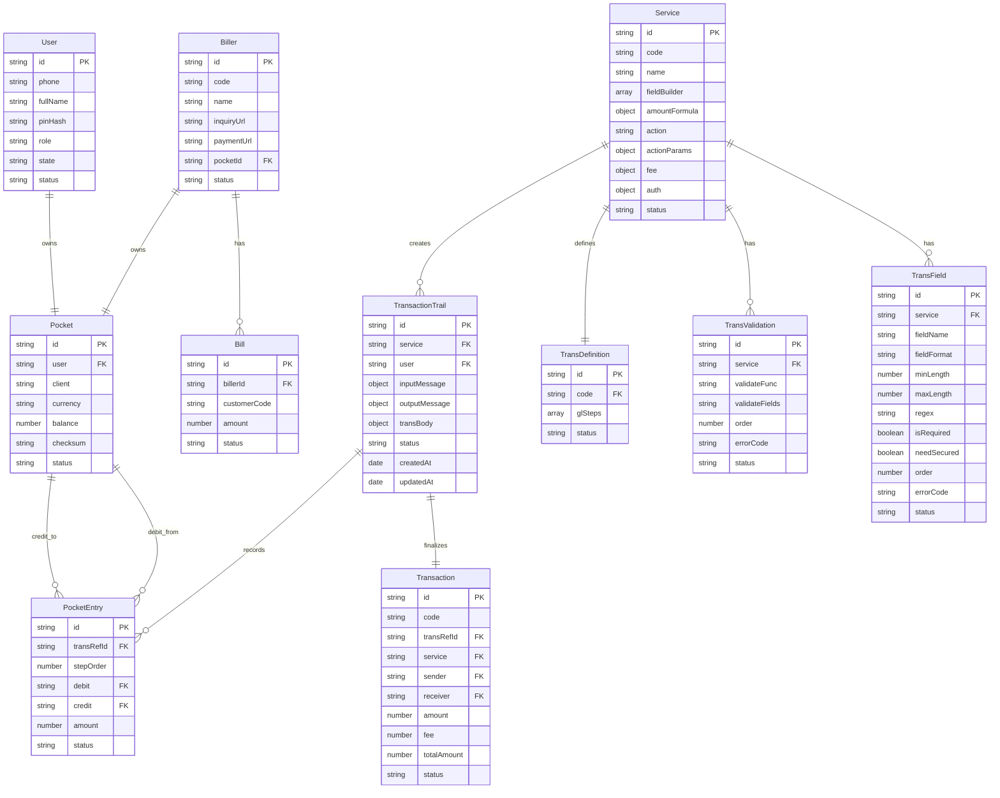

# Mini-Wallet ERD

```mermaid
erDiagram

    User ||--|| Pocket : owns

    Service ||--o{ TransField : has
    Service ||--o{ TransValidation : has
    Service ||--|| TransDefinition : defines
    Service ||--o{ TransactionTrail : creates

    TransactionTrail ||--|| Transaction : finalizes
    TransactionTrail ||--o{ PocketEntry : records

    Pocket ||--o{ PocketEntry : debit_from
    Pocket ||--o{ PocketEntry : credit_to

    Biller ||--o{ Bill : has
    Biller ||--|| Pocket : owns

    User {
        string id PK
        string phone
        string fullName
        string pinHash
        string role
        string state
        string status
    }

    Pocket {
        string id PK
        string user FK
        string client
        string currency
        number balance
        string checksum
        string status
    }

    Service {
        string id PK
        string code
        string name
        array fieldBuilder
        object amountFormula
        string action
        object actionParams
        object fee
        object auth
        string status
    }

    TransField {
        string id PK
        string service FK
        string fieldName
        string fieldFormat
        number minLength
        number maxLength
        string regex
        boolean isRequired
        boolean needSecured
        number order
        string errorCode
        string status
    }

    TransValidation {
        string id PK
        string service FK
        string validateFunc
        string validateFields
        number order
        string errorCode
        string status
    }

    TransDefinition {
        string id PK
        string code FK
        array glSteps
        string status
    }

    TransactionTrail {
        string id PK
        string service FK
        string user FK
        object inputMessage
        object outputMessage
        object transBody
        string status
        date createdAt
        date updatedAt
    }

    Transaction {
        string id PK
        string code
        string transRefId FK
        string service FK
        string sender FK
        string receiver FK
        number amount
        number fee
        number totalAmount
        string status
    }

    PocketEntry {
        string id PK
        string transRefId FK
        number stepOrder
        string debit FK
        string credit FK
        number amount
        string status
    }

    Biller {
        string id PK
        string code
        string name
        string inquiryUrl
        string paymentUrl
        string pocketId FK
        string status
    }

    Bill {
        string id PK
        string billerId FK
        string customerCode
        number amount
        string status
    }
```