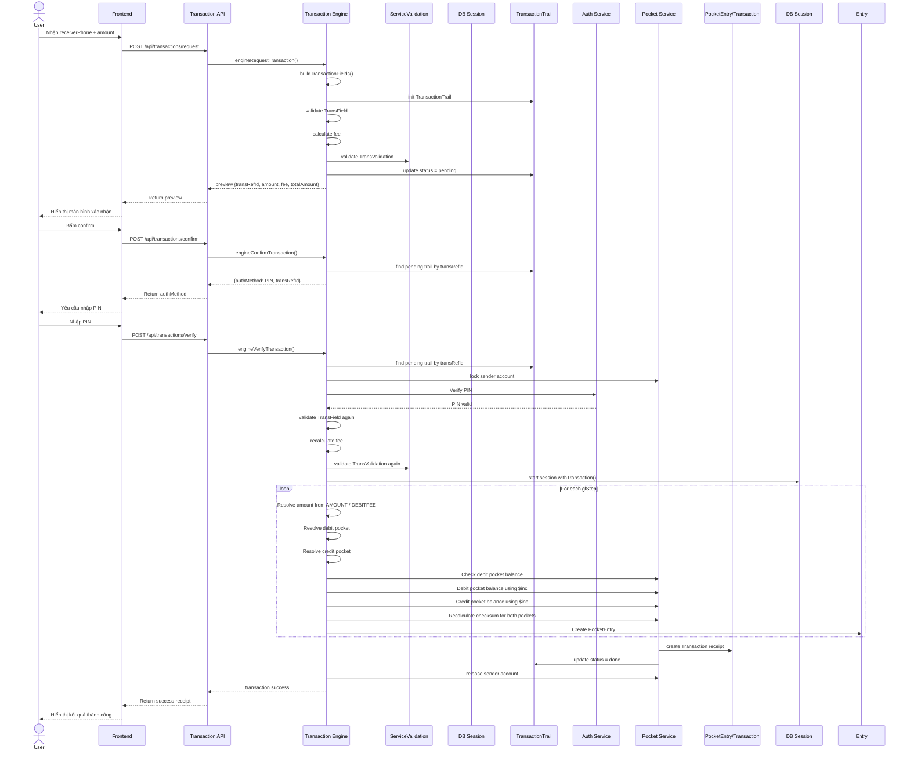
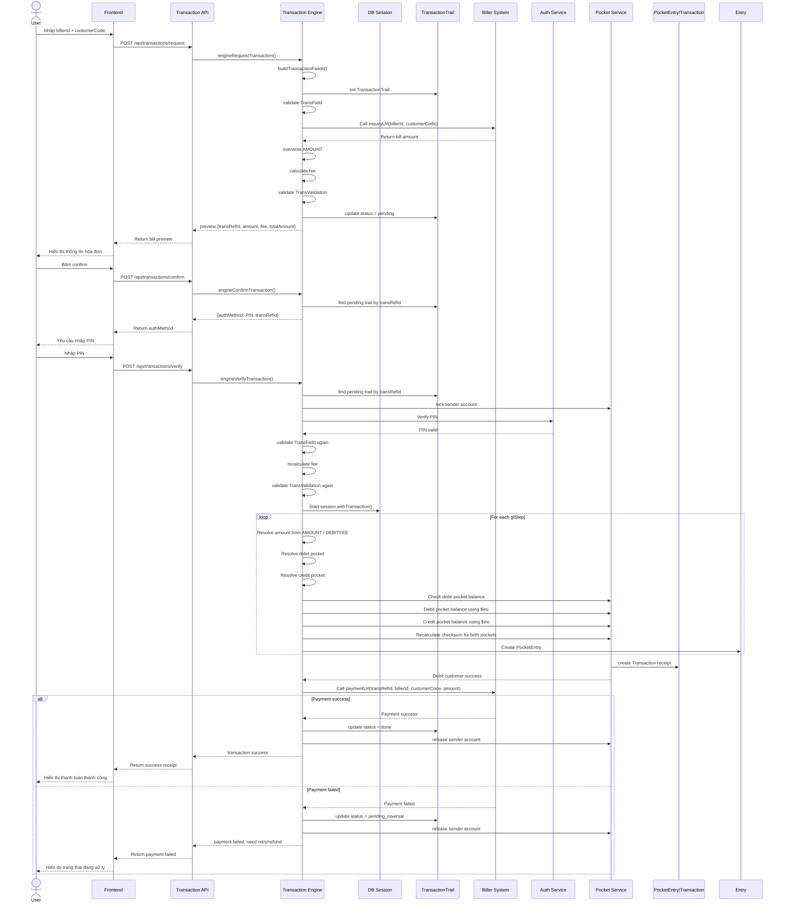

# Mini-Wallet Sequence Diagrams

## 1. P2P Transfer Sequence

```mermaid
sequenceDiagram
    actor User
    participant FE as Frontend
    participant API as Transaction API
    participant Engine as Transaction Engine
    participant ServiceValidation as ServiceValidation
    participant DB as DB Session
    participant Trail as TransactionTrail
    participant Auth as Auth Service
    participant Pocket as Pocket Service
    participant Ledger as PocketEntry/Transaction
   

    User->>FE: Nhập receiverPhone + amount
    FE->>API: POST /api/transactions/request
    API->>Engine: engineRequestTransaction()
    Engine->>Engine: buildTransactionFields()
    Engine->>Trail: init TransactionTrail
    Engine->>Engine: validate TransField
    Engine->>Engine: calculate fee
    Engine->> ServiceValidation: validate TransValidation
    Engine->>Trail: update status = pending
    Engine-->>API: preview {transRefId, amount, fee, totalAmount}
    API-->>FE: Return preview
    FE-->>User: Hiển thị màn hình xác nhận

    User->>FE: Bấm confirm
    FE->>API: POST /api/transactions/confirm
    API->>Engine: engineConfirmTransaction()
    Engine->>Trail: find pending trail by transRefId
    Engine-->>API: {authMethod: PIN, transRefId}
    API-->>FE: Return authMethod
    FE-->>User: Yêu cầu nhập PIN

    User->>FE: Nhập PIN
    FE->>API: POST /api/transactions/verify
    API->>Engine: engineVerifyTransaction()
    Engine->>Trail: find pending trail by transRefId
    Engine->>Pocket: lock sender account
    Engine->>Auth: Verify PIN
    Auth-->>Engine: PIN valid
    Engine->>Engine: validate TransField again
    Engine->>Engine: recalculate fee
    Engine->>ServiceValidation: validate TransValidation again
  
    Engine->>DB Session: start session.withTransaction()

    loop For each glStep
        Engine->>Engine: Resolve amount from AMOUNT / DEBITFEE
        Engine->>Engine: Resolve debit pocket
        Engine->>Engine: Resolve credit pocket
        Engine->>Pocket: Check debit pocket balance
        Engine->>Pocket: Debit pocket balance using $inc
        Engine->>Pocket: Credit pocket balance using $inc
        Engine->>Pocket: Recalculate checksum for both pockets
        Engine->>Entry: Create PocketEntry
    end


   
    Pocket->>Ledger: create Transaction receipt
    Pocket->>Trail: update status = done
    Engine->>Pocket: release sender account
    Engine-->>API: transaction success
    API-->>FE: Return success receipt
    FE-->>User: Hiển thị kết quả thành công
```

## 2. Bill Payment Sequence

```mermaid
sequenceDiagram
    actor User
    participant FE as Frontend
    participant API as Transaction API
    participant Engine as Transaction Engine
    participant DB as DB Session
    participant Trail as TransactionTrail
    participant Biller as Biller System
    participant Auth as Auth Service
    participant Pocket as Pocket Service
    participant Ledger as PocketEntry/Transaction

    User->>FE: Nhập billerId + customerCode
    FE->>API: POST /api/transactions/request
    API->>Engine: engineRequestTransaction()
    Engine->>Engine: buildTransactionFields()
    Engine->>Trail: init TransactionTrail
    Engine->>Engine: validate TransField
    Engine->>Biller: Call inquiryUrl(billerId, customerCode)
    Biller-->>Engine: Return bill amount
    Engine->>Engine: overwrite AMOUNT
    Engine->>Engine: calculate fee
    Engine->>Engine: validate TransValidation
    Engine->>Trail: update status = pending
    Engine-->>API: preview {transRefId, amount, fee, totalAmount}
    API-->>FE: Return bill preview
    FE-->>User: Hiển thị thông tin hóa đơn

    User->>FE: Bấm confirm
    FE->>API: POST /api/transactions/confirm
    API->>Engine: engineConfirmTransaction()
    Engine->>Trail: find pending trail by transRefId
    Engine-->>API: {authMethod: PIN, transRefId}
    API-->>FE: Return authMethod
    FE-->>User: Yêu cầu nhập PIN

    User->>FE: Nhập PIN
    FE->>API: POST /api/transactions/verify
    API->>Engine: engineVerifyTransaction()
    Engine->>Trail: find pending trail by transRefId
    Engine->>Pocket: lock sender account
    Engine->>Auth: Verify PIN
    Auth-->>Engine: PIN valid
    Engine->>Engine: validate TransField again
    Engine->>Engine: recalculate fee
    Engine->>Engine: validate TransValidation again
   
    Engine->>DB: Start session.withTransaction();
    
    loop For each glStep
        Engine->>Engine: Resolve amount from AMOUNT / DEBITFEE
        Engine->>Engine: Resolve debit pocket
        Engine->>Engine: Resolve credit pocket
        Engine->>Pocket: Check debit pocket balance
        Engine->>Pocket: Debit pocket balance using $inc
        Engine->>Pocket: Credit pocket balance using $inc
        Engine->>Pocket: Recalculate checksum for both pockets
        Engine->>Entry: Create PocketEntry
    end

    
    Pocket->>Ledger: create Transaction receipt
    Pocket-->>Engine: Debit customer success

    Engine->>Biller: Call paymentUrl(transRefId, billerId, customerCode, amount)

    alt Payment success
        Biller-->>Engine: Payment success
        Engine->>Trail: update status = done
        Engine->>Pocket: release sender account
        Engine-->>API: transaction success
        API-->>FE: Return success receipt
        FE-->>User: Hiển thị thanh toán thành công

    else Payment failed
        Biller-->>Engine: Payment failed
        Engine->>Trail: update status = pending_reversal
        Engine->>Pocket: release sender account
        Engine-->>API: payment failed, need retry/refund
        API-->>FE: Return payment failed
        FE-->>User: Hiển thị trạng thái đang xử lý
    end
```
