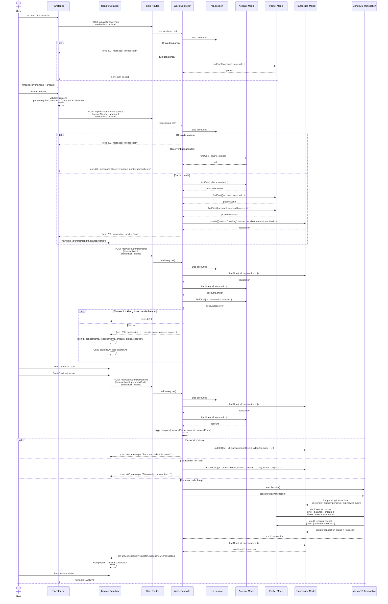

# Transfer Sequence Diagram

## Muc Tieu Luong

Nguoi dung dang nhap, nhap so dien thoai nguoi nhan va so tien, sau do he thong tao mot giao dich `pending`. Nguoi dung sang man hinh chi tiet, nhap `personalCode`, roi backend moi thuc hien tru tien vi gui, cong tien vi nhan va cap nhat transaction thanh `success`.

## API Lien Quan

| API | Controller | Vai tro |
|---|---|---|
| `POST /api/wallet/overview` | `WalletController.overview` | Lay vi hien tai cua nguoi dang nhap |
| `POST /api/wallet/transfer/request` | `WalletController.request` | Tao transaction `pending` |
| `POST /api/wallet/transfer/detail` | `WalletController.detail` | Lay chi tiet transaction de hien thi man confirm |
| `POST /api/wallet/transfer/confirm` | `WalletController.confirm` | Xac thuc personal code va chuyen tien that |

## Sequence Diagram Tong Quan

